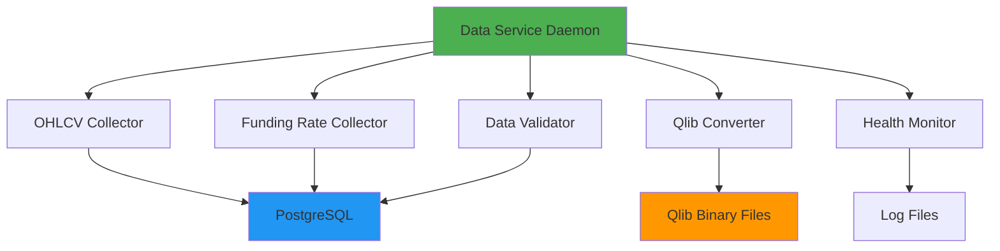

# 自动化数据服务实施计划

## 目标

创建一个连续运行的数据服务，自动完成：
1. OHLCV数据下载（1分钟原始数据）
2. Funding Rate数据下载
3. 数据验证和质量检查
4. 自动转换为Qlib二进制格式（多时间框架）
5. 健康监控和错误恢复

---

## 架构设计

### 服务组件



### 数据流程

```
1. 定时触发 (每15分钟)
   ↓
2. 检查最后更新时间
   ↓
3. 下载增量OHLCV数据 → PostgreSQL
   ↓
4. [条件] 如果 market_type = future/swap
   ├─ YES → 下载增量Funding Rate → PostgreSQL
   └─ NO (spot) → 跳过 funding rate
   ↓
5. 数据验证 (OHLC逻辑、缺失值、异常值)
   ↓
6. 转换为Qlib格式 (15min, 60min, 240min)
   ↓
7. 更新状态文件
   ↓
8. 等待下一个周期
```

---

## 实施步骤

### Phase 1: 核心服务框架 ✅

#### 1.1 创建主服务脚本

**文件**: `scripts/data_service.py`

**功能**:
- 守护进程模式运行
- 配置化的更新间隔
- 优雅的启动/停止/重启
- PID文件管理
- 信号处理 (SIGTERM, SIGINT)

**配置参数** (在 `config/workflow.json` 中):
```json
{
  "data": {
    "csv_data_dir": "data/klines",
    "normalize_dir": "data/normalize",
    "bin_data_dir": "data/qlib_data/crypto",
    "market_type": "future",  // "future" 或 "spot"
    "symbols": "config/instruments.json"
  },
  "data_service": {
    "enabled": true,
    "update_interval_minutes": 15,
    "symbols": "config/instruments.json",
    "timeframes": ["15min", "60min", "240min"],
    "enable_funding_rate": "auto",  // "auto" (根据market_type), true, false
    "enable_validation": true,
    "enable_auto_convert": true,
    "max_retries": 3,
    "retry_delay_seconds": 60
  }
}
```

> [!IMPORTANT]
> **Funding Rate 条件逻辑**
> - 当 `data.market_type = "future"` 或 `"swap"` 时，自动下载 funding rate
> - 当 `data.market_type = "spot"` 时，跳过 funding rate 下载
> - 可通过 `enable_funding_rate` 手动覆盖：
>   - `"auto"`: 根据 market_type 自动判断（推荐）
>   - `true`: 强制启用（仅用于 future/swap）
>   - `false`: 强制禁用

#### 1.2 集成现有组件

**复用**:
- `okx_data_collector.py` 的OHLCV下载逻辑
- `fetch_funding_rates.py` 的funding rate下载逻辑
- `convert_to_qlib.py` 的转换逻辑
- `validate_downloaded_data()` 的验证逻辑

**优化**:
- 将这些脚本重构为可导入的模块
- 提取核心函数，避免重复的argparse和main()

---

### Phase 2: Funding Rate集成 🔄

#### 2.1 增强 `okx_data_collector.py`

**新增函数**: `fetch_funding_rates_batch()`

```python
def fetch_funding_rates_batch(
    symbols: List[str],
    start_time: str,
    end_time: str,
    postgres_storage: PostgreSQLStorage,
    market_type: str = "future"
) -> Dict[str, int]:
    """
    批量下载funding rate数据
    
    Args:
        market_type: "future", "swap", or "spot"
    
    Returns:
        Dict[symbol, row_count]
    
    Note:
        如果 market_type="spot"，直接返回空字典（现货无funding rate）
    """
    # 现货市场跳过
    if market_type.lower() == "spot":
        logger.info("Spot market detected, skipping funding rate collection")
        return {}
    
    # 永续合约才下载
    if market_type.lower() not in ["future", "swap"]:
        logger.warning(f"Unknown market_type: {market_type}, skipping funding rate")
        return {}
```

**实现**:
- 使用 `exchange.fetch_funding_rate_history()` REST API
- **条件检查**: 仅在 `market_type` 为 `future` 或 `swap` 时下载
- 自动检测最后时间戳，只下载增量数据
- 直接保存到PostgreSQL的 `funding_rates` 表
- 返回每个符号的下载行数

#### 2.2 自动合并到OHLCV

**新增函数**: `merge_funding_rates_to_ohlcv()`

```python
def merge_funding_rates_to_ohlcv(
    symbols: List[str],
    postgres_storage: PostgreSQLStorage
) -> bool:
    """
    将funding_rates表的数据合并到ohlcv_data表
    使用forward-fill策略
    """
```

**SQL逻辑**:
```sql
UPDATE ohlcv_data o
SET funding_rate = (
    SELECT f.funding_rate
    FROM funding_rates f
    WHERE f.symbol = o.symbol
      AND f.timestamp <= o.timestamp
    ORDER BY f.timestamp DESC
    LIMIT 1
)
WHERE o.symbol = %s
  AND o.funding_rate IS NULL;
```

---

### Phase 3: 增量转换优化 🚀

#### 3.1 增强 `convert_to_qlib.py`

**新增参数**: `--incremental`

**逻辑**:
1. 检查Qlib二进制文件的最后日期
2. 只转换新增的数据
3. 追加到现有二进制文件

**伪代码**:
```python
def convert_incremental(symbol, freq):
    # 1. 读取现有Qlib文件的最后日期
    last_date = get_last_date_from_qlib(symbol, freq)
    
    # 2. 从DB读取新数据
    new_data = load_from_db(symbol, start=last_date)
    
    # 3. 重采样
    resampled = resample_data(new_data, freq)
    
    # 4. 追加到Qlib文件
    append_to_qlib(symbol, freq, resampled)
```

**优点**:
- 避免重复转换历史数据
- 大幅提升转换速度（秒级 vs 分钟级）

---

### Phase 4: 健康监控 📊

#### 4.1 状态文件

**文件**: `data/service_status.json`

```json
{
  "last_update": "2026-01-21T18:30:00Z",
  "last_success": "2026-01-21T18:30:00Z",
  "symbols": {
    "ETHUSDT": {
      "ohlcv_last_timestamp": "2026-01-21T18:29:00Z",
      "funding_rate_last_timestamp": "2026-01-21T18:00:00Z",
      "qlib_15min_last_date": "2026-01-21",
      "qlib_60min_last_date": "2026-01-21",
      "validation_status": "passed",
      "last_error": null
    }
  },
  "service_uptime_hours": 120.5,
  "total_updates": 480,
  "failed_updates": 2
}
```

#### 4.2 监控指标

- **数据新鲜度**: 最后更新时间 vs 当前时间
- **数据完整性**: 预期行数 vs 实际行数
- **错误率**: 失败次数 / 总次数
- **服务可用性**: 运行时间 / 总时间

#### 4.3 告警机制

**触发条件**:
- 数据延迟 > 1小时
- 连续失败 > 3次
- 验证失败率 > 10%

**告警方式**:
- 日志记录 (ERROR级别)
- 状态文件标记
- 可选: 邮件/Webhook通知

---

## 使用方式

### 启动服务

```bash
# 前台运行 (调试)
python scripts/data_service.py --foreground

# 后台运行 (生产)
python scripts/data_service.py --daemon

# 指定配置文件
python scripts/data_service.py --config config/workflow.json --daemon
```

### 停止服务

```bash
# 优雅停止
python scripts/data_service.py --stop

# 或使用kill
kill $(cat data/data_service.pid)
```

### 查看状态

```bash
# 查看服务状态
python scripts/data_service.py --status

# 查看详细状态
cat data/service_status.json | jq
```

### 手动触发更新

```bash
# 强制立即更新
python scripts/data_service.py --force-update
```

---

## 配置示例

### `config/workflow.json`

```json
{
  "data": {
    "csv_data_dir": "data/klines",
    "normalize_dir": "data/normalize",
    "bin_data_dir": "data/qlib_data/crypto",
    "market_type": "future",
    "symbols": "config/instruments.json"
  },
  "data_service": {
    "enabled": true,
    "update_interval_minutes": 15,
    "symbols": "config/instruments.json",
    "base_interval": "1m",
    "target_timeframes": ["15min", "60min", "240min"],
    "enable_funding_rate": "auto",
    "enable_validation": true,
    "enable_auto_convert": true,
    "max_retries": 3,
    "retry_delay_seconds": 60,
    "pid_file": "data/data_service.pid",
    "status_file": "data/service_status.json"
  },
  "data_collection": {
    "interval": "1m",
    "start_time": "2020-01-01",
    "end_time": "",
    "output": "db"
  },
  "database": {
    "host": "localhost",
    "port": 5432,
    "database": "qlib_crypto",
    "user": "crypto_user",
    "password": "crypto"
  }
}
```

---

## 优势

### 1. 自动化 ✅
- 无需手动运行多个脚本
- 定时自动更新
- 自动错误恢复

### 2. 高效 ⚡
- 增量下载（只获取新数据）
- 增量转换（只转换新数据）
- 并行处理（多符号同时下载）

### 3. 可靠 🛡️
- 数据验证
- 错误重试
- 状态持久化
- 优雅关闭

### 4. 可观测 📊
- 详细日志
- 状态文件
- 健康检查
- 性能指标

---

## 实施时间表

| 阶段 | 任务 | 预计时间 | 优先级 |
|------|------|----------|--------|
| Phase 1 | 创建服务框架 | 2小时 | P0 |
| Phase 1 | 集成现有组件 | 1小时 | P0 |
| Phase 2 | Funding Rate集成 | 1.5小时 | P0 |
| Phase 3 | 增量转换优化 | 2小时 | P1 |
| Phase 4 | 健康监控 | 1小时 | P1 |
| **总计** | | **7.5小时** | |

---

## 风险和缓解

### 风险1: API限流
**影响**: 下载失败
**缓解**: 
- 实现指数退避重试
- 监控API调用频率
- 使用多个API密钥轮换

### 风险2: 数据库连接失败
**影响**: 无法保存数据
**缓解**:
- 连接池管理
- 自动重连机制
- 临时CSV备份

### 风险3: 磁盘空间不足
**影响**: Qlib文件写入失败
**缓解**:
- 磁盘空间监控
- 自动清理旧日志
- 压缩历史数据

---

## 后续优化

### P2优先级
- [ ] 分布式部署支持
- [ ] 多交易所数据源
- [ ] 实时WebSocket数据流
- [ ] 数据质量报告生成
- [ ] Web UI监控面板

### P3优先级
- [ ] 数据版本控制
- [ ] A/B测试支持
- [ ] 自动数据修复
- [ ] 机器学习异常检测

---

## 验证计划

### 单元测试
- [ ] 服务启动/停止
- [ ] 增量数据检测
- [ ] Funding rate合并
- [ ] 状态文件更新

### 集成测试
- [ ] 完整更新周期
- [ ] 错误恢复
- [ ] 并发安全性

### 性能测试
- [ ] 20个符号 × 3个时间框架
- [ ] 目标: < 5分钟/更新周期
- [ ] 内存使用 < 2GB

---

## 总结

这个自动化数据服务将：
1. ✅ **统一数据管道** - 单一服务管理所有数据流
2. ✅ **自动化运维** - 无需人工干预
3. ✅ **高可靠性** - 错误恢复和监控
4. ✅ **高性能** - 增量处理和并行化
5. ✅ **易于维护** - 清晰的架构和日志

**下一步**: 开始实施 Phase 1 - 创建核心服务框架
